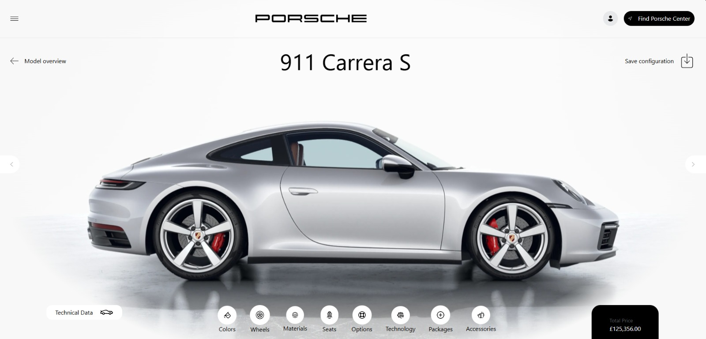
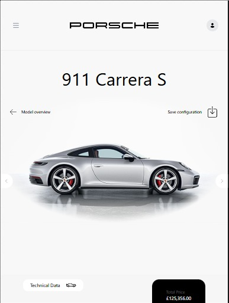

# Página de Venda Porsche – Projeto Responsivo com HTML e TailwindCSS

Este projeto é uma simulação de uma página de venda do modelo **911 Carrera S** da Porsche, desenvolvida com foco em responsividade e estética refinada. O layout é totalmente responsivo, adaptando-se para **desktop**, **tablet** e **mobile**, e utiliza exclusivamente **HTML** e **TailwindCSS**.

### Desktop



### Tablet



### Mobile


## ✨ Objetivo

O projeto tem como finalidade exercitar a criação de interfaces web responsivas utilizando apenas HTML semântico e TailwindCSS como framework de estilização. Ele também explora elementos interativos como botões, navegação e estruturação de conteúdo em múltiplos dispositivos.

---

## 🧩 Tecnologias Utilizadas

- HTML5
- [TailwindCSS](https://tailwindcss.com/) (via CDN)

---

## 🚀 Como Rodar o Projeto Localmente

1. **Clone o repositório:**

   ```bash
   git clone https://github.com/tabguimaraes/porsche.git
   ```

## 🏜️ Página do design no Figma

https://www.figma.com/design/hvqlNSWTmzo8t9P812Uhfu/lima---porsche--Copy-?node-id=0-1&m=dev
